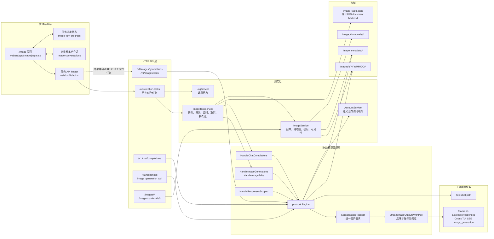
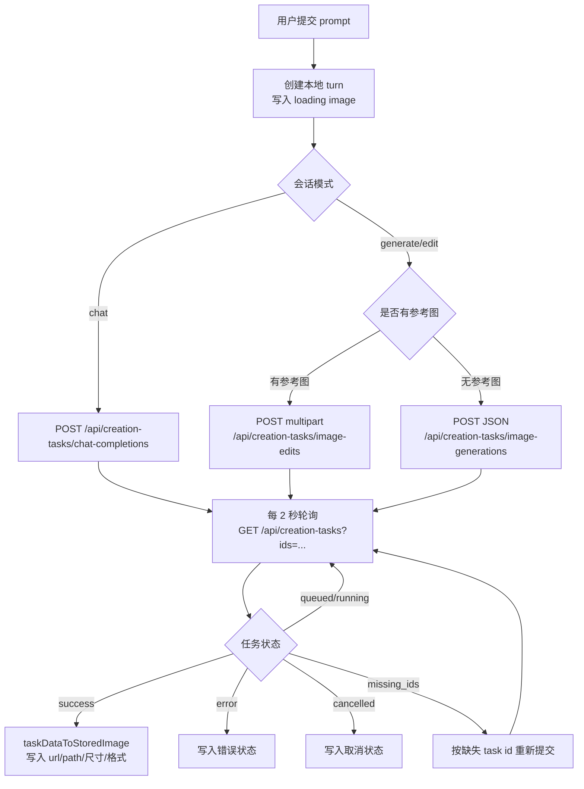
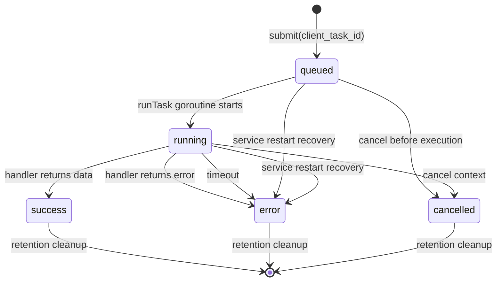
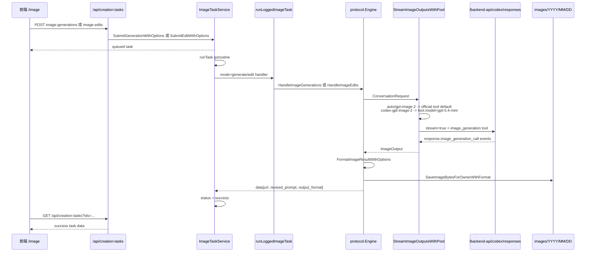
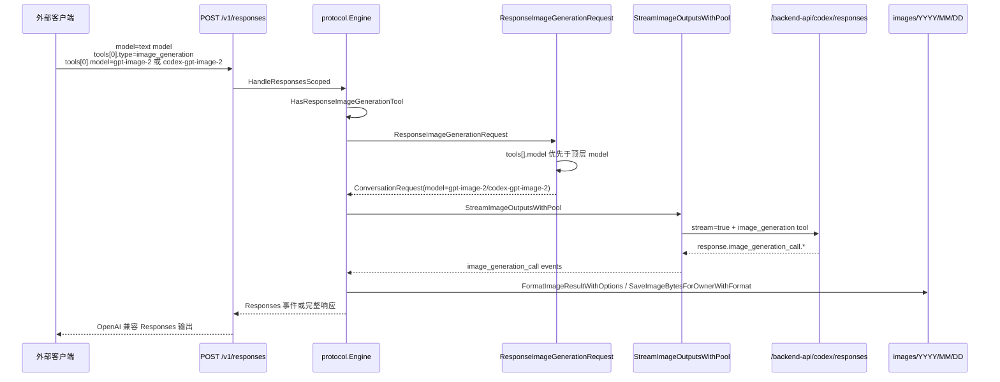
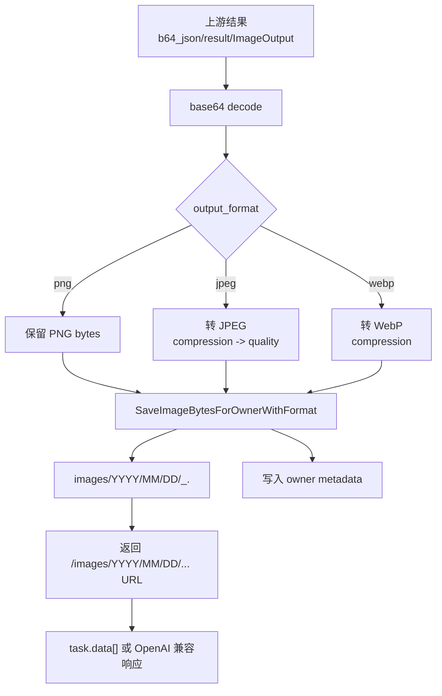
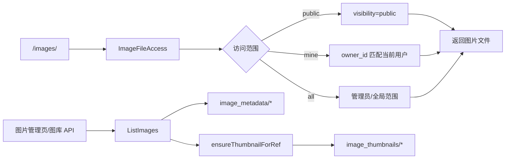

# 生图架构文档

本文说明当前项目的图片生成、图片编辑、Responses `image_generation` 工具调用、任务排队、图片落盘和图库管理架构。文档描述当前实现，不包含旧路由兼容方案，也不覆盖 CPA 相关导入链路。

## 目标与边界

当前生图系统分为两类入口：

- 管理端异步创作任务：供 `web/src/app/image` 图片工作台使用，支持排队、轮询、取消、任务恢复和图库落盘。
- OpenAI 兼容接口：供外部 API 客户端调用，包括 `/v1/images/generations`、`/v1/images/edits`、`/v1/chat/completions` 和 `/v1/responses`。

管理端异步创作任务只保留三种模式：

- `generate`：文生图，提交到 `/api/creation-tasks/image-generations`。
- `edit`：图生图或参考图编辑，提交到 `/api/creation-tasks/image-edits`。
- `chat`：图片工作台中的文本/对话补全，提交到 `/api/creation-tasks/chat-completions`。

`/v1/responses` 是 OpenAI 兼容入口，不是管理端异步任务资源。项目不提供 `/api/creation-tasks/response-image-generations`，也不再通过 admin 任务层构造 Responses 作画请求。

## 总体架构图



## 管理端提交与轮询

图片工作台位于 `web/src/app/image/page.tsx`。用户提交后，前端先创建本地 conversation turn 和 loading 图片占位，再根据当前模式和是否存在参考图选择任务接口。



关键规则：

- `client_task_id` 由前端生成，并作为后端任务幂等键。
- 一轮 turn 可能包含多张图片，前端会把连续 loading 图片合并为 task group 后提交。
- 文生图只提交到 `/api/creation-tasks/image-generations`。
- 有参考图的图片请求只提交到 `/api/creation-tasks/image-edits`。
- 对话补全只提交到 `/api/creation-tasks/chat-completions`。
- `missing_ids` 会触发重新提交，用于恢复前端仍在 loading 但后端任务已清理或丢失的情况。

## 模型路由

前端模型集合定义在 `web/src/lib/api.ts`。当前管理端路由规则如下：

| 场景 | 可选模型 | 任务路径 |
| --- | --- | --- |
| 图片生成 / 图片编辑 | `auto`、`gpt-image-2`、`codex-gpt-image-2` | `/api/creation-tasks/image-generations` 或 `/api/creation-tasks/image-edits` |
| 图片工作台对话 | `auto`、`gpt-5-mini`、`gpt-5-3-mini`、`gpt-5`、`gpt-5-1`、`gpt-5-2`、`gpt-5-3`、`gpt-5.4`、`gpt-5.5` | `/api/creation-tasks/chat-completions` |
| OpenAI 兼容 Responses 作画 | 顶层文本模型 + `tools[].model=gpt-image-2` 或 `codex-gpt-image-2` | `/v1/responses` |

管理端图片创作模型不包含文本模型。文本模型不会再被前端分流到旧的 admin Responses 图片任务路径。

`codex-gpt-image-2` 不提交 `quality` 参数；`gpt-image-2` 和 `auto` 可提交 `low`、`medium`、`high`。

模型到上游路径的边界：

- `gpt-image-2` 走官网图片链路：请求 `/backend-api/codex/responses`，使用 `image_generation` tool 的官方默认图片模型，不透传合成模型名。
- `codex-gpt-image-2` 走 Codex TUI 风格链路：请求 `/backend-api/codex/responses`，使用 Codex TUI headers，并将 tool model 映射为 `gpt-5.4-mini`，不会把 `codex-gpt-image-2` 合成别名发给上游。
- `auto` 默认落到官网 `gpt-image-2` 图片链路。
- 账号池不会因为账号类型是 `Free` 就在本地提前阻断图片请求。Free 账号没有对应图片工具权限时，上游可能直接返回失败，失败会进入现有账号错误、限流和任务错误处理。

## 异步任务生命周期

异步任务由 `internal/service/image_task.go` 中的 `ImageTaskService` 管理。



任务服务职责：

- 使用 `owner_id + client_task_id` 作为任务唯一键，重复提交直接返回已有任务。
- 将任务状态持久化到 `image_tasks.json` 或 JSON document backend。
- 只接受 `generate`、`edit`、`chat` 三种 mode。
- 图片任务进入全局图片并发槽，默认并发上限为 4，可由配置覆盖。
- 普通用户受用户并发限制和用户 RPM 限制约束。
- 每个任务使用独立 context，支持取消和超时。
- 服务启动时将未完成的 `queued`、`running` 任务标记为失败，错误信息为服务重启中断。
- 已完成、失败、取消的任务按保留天数清理。

公开任务响应包含：

- `id`
- `status`
- `mode`
- `model`
- `size`
- `quality`
- `output_format`
- `output_compression`
- `created_at`
- `updated_at`
- `data`
- `error`
- `output_type`
- `visibility`

## Images API 生图链路

文生图和图生图最终都会进入 `protocol.Engine`：

- `HandleImageGenerations`：处理文生图。
- `HandleImageEdits`：处理图生图，先将上传图片编码为模型输入。



图片请求统一构造 `ConversationRequest`，主要字段包括：

- `prompt`
- `model`
- `messages`
- `n`
- `size`
- `quality`
- `background`
- `moderation`
- `style`
- `output_format`
- `output_compression`
- `partial_images`
- `response_format`
- `base_url`
- `owner_id`
- `owner_name`
- `images`，仅图生图存在
- `input_image_mask`，Responses 编辑链路使用
- `RequirePaidAccount`，大尺寸请求会启用

`auto`、`gpt-image-2` 和 `codex-gpt-image-2` 都不再通过 `picture_v2` prompt hint 触发生图；它们统一构造真实的 `/backend-api/codex/responses` payload，使用 `tools[0].type=image_generation`、`tool_choice=image_generation` 和结构化 tool 字段。差异只在 tool model：`auto`/`gpt-image-2` 省略 `tools[0].model`，由官方图片工具默认选择；`codex-gpt-image-2` 映射为 `tools[0].model=gpt-5.4-mini`。

Responses 上游只接受 `WIDTHxHEIGHT` 形式的工具尺寸。外部 API 和管理端仍可以提交比例或分辨率档位，但后端在构造 upstream payload 时会执行 Responses 专用归一化：

- `auto` 或空值：省略 `tools[0].size`，交给上游默认策略。
- `1:1`、`3:2`、`2:3`、`16:9`、`9:16`、`4:3`、`3:4` 等比例：转换为满足 Codex Responses 约束的像素尺寸。
- `1080p`、`2k`、`4k` 和显式 `WIDTHxHEIGHT`：对齐为 16 的倍数，并限制最长边、宽高比和总像素范围。
- 非法尺寸：不向上游发送 `tools[0].size`，避免把 API 友好的显示值原样传给 Codex Responses。

当前约束与参考实现保持一致：边长必须是 16 的倍数，最长边不超过 3840，宽高比不超过 3:1，总像素范围为 655360 到 8294400。

## Responses image_generation 链路

`/v1/responses` 由 `internal/httpapi/app.go` 的 `handleResponses` 接收，再进入 `protocol.Engine.HandleResponsesScoped`。这条路径不经过 `ImageTaskService`，也没有 admin 任务轮询。



推荐请求形态：

```json
{
  "model": "gpt-5.5",
  "input": "生成一张未来感城市天际线图片",
  "tools": [
    {
      "type": "image_generation",
      "model": "gpt-image-2",
      "size": "2048x2048",
      "quality": "high",
      "output_format": "png"
    }
  ],
  "tool_choice": {
    "type": "image_generation"
  },
  "n": 1
}
```

解析规则：

- 只有 `tools` 中存在 `type=image_generation` 时才进入图片生成链路。
- `tools[].model` 优先于顶层 `model`，因此 `model=gpt-5.5` + `tools[].model=gpt-image-2` 会落到 `gpt-image-2` 图片链路。
- 如果没有 `tools[].model`，顶层 `model` 会作为图片工具模型来源；文本模型和 `auto` 会映射到官方 `gpt-image-2` 图片工具模型。
- `tools[].model=codex-gpt-image-2` 会进入 Codex TUI 风格 Responses 链路，并在上游 payload 中映射为 `tools[0].model=gpt-5.4-mini`。
- 图片参数优先读取 tool 内字段，再回退到 body 顶层字段。
- 支持 `size`、`quality`、`background`、`moderation`、`style`、`output_format`、`output_compression`、`partial_images`、`input_image_mask`、`response_format`、`n`。
- 输入中的 `input_image` data URL 会被提取为参考图。
- `previous_response_id` 对应的上下文图片会合并进当前图片请求，最多保留最近的上下文图片。

## 图片落盘与结果格式

所有成功图片都通过 `FormatImageResultWithOptions` 规范化，再通过 `SaveImageBytesForOwnerWithFormat` 写入本机。



任务结果中的 `data[]` 主要包含：

- `url`：本机可访问图片地址。
- `b64_json`：仅当请求需要 `b64_json` 时返回处理后的图片 base64。
- `revised_prompt`：上游修订后的 prompt，缺失时回退为原始 prompt。
- `output_format`：最终落盘格式。
- `width`、`height`、`resolution`：前端或图库刷新时可补齐。

文件路径规则：

```text
images/YYYY/MM/DD/<unix_timestamp>_<md5>.<png|jpg|webp>
```

## 图库、缩略图与访问控制

`ImageService` 管理图片资产、缩略图、元数据和访问控制。



图片元数据包含：

- `owner_id`
- `owner_name`
- `visibility`
- `published_at`
- `resolution_preset`
- `requested_size`
- `output_format`

可见性规则：

- 默认是 `private`。
- `public` 图片允许公开范围访问。
- 私有图片只有 owner 或全局权限范围可访问。
- 从 `private` 改为 `public` 时写入 `published_at`。
- 从 `public` 改回 `private` 时清空 `published_at`。

缩略图规则：

- 缩略图最大边为 480。
- 缩略图格式为 JPEG。
- 缩略图元数据记录原图宽高、缩略图版本、大小和质量。
- 缩略图文件与元数据会随图片删除一起清理。

## OpenAI 兼容直连接口

外部客户端可以直接调用：

- `POST /v1/images/generations`
- `POST /v1/images/edits`
- `POST /v1/chat/completions`
- `POST /v1/responses`

这些路径不经过 `ImageTaskService` 排队，也没有异步轮询。handler 会直接调用 `protocol.Engine`，然后通过 `writeProtocol` 返回 OpenAI 兼容响应。

直连接口仍会：

- 注入 `owner_id` 和 `owner_name`。
- 设置 `base_url`。
- 规范化 `visibility`。
- 将图片保存到本机 `/images/...`。
- 记录调用日志。

适用场景：

- 外部 API 客户端需要 OpenAI 兼容响应。
- 客户端自己承担请求等待、超时和重试。

不适用场景：

- 管理端需要可取消、可恢复、可轮询的生成体验。
- 多任务并发需要统一用户限流和排队。

## 错误与恢复策略

| 场景 | 当前行为 |
| --- | --- |
| prompt 为空 | 提交失败，返回 `prompt is required` |
| `client_task_id` 为空 | 提交失败，返回 `client_task_id is required` |
| 重复提交同一任务 | 返回已有任务，不重复执行 |
| 用户并发超限 | 提交失败，返回用户并发限制错误 |
| 用户 RPM 超限 | 提交失败，返回用户 RPM 限制错误 |
| 用户取消任务 | 状态变为 `cancelled`，context 被取消 |
| 任务超时 | 状态变为 `error`，提示图片生成超时 |
| 服务重启 | 未完成任务变为 `error`，提示服务重启中断 |
| 上游返回部分图片 | 已返回图片保留在 `data[]`，任务可带错误状态 |
| `/v1/responses` 返回文本事件 | 按 Responses 文本路径返回，不写入 admin 图片任务 |
| 前端轮询发现 missing id | 前端按缺失 task id 重新提交 |

## 关键代码位置

| 模块 | 文件 |
| --- | --- |
| 图片工作台页面与轮询 | `web/src/app/image/page.tsx` |
| 前端任务 API helper | `web/src/lib/api.ts` |
| 异步任务路由 | `internal/httpapi/routes.go` |
| OpenAI 兼容入口 | `internal/httpapi/app.go` |
| 异步任务服务 | `internal/service/image_task.go` |
| 图库、缩略图、可见性 | `internal/service/image.go` |
| Images / Responses 协议入口 | `internal/protocol/api.go` |
| 图片结果格式化与落盘 | `internal/protocol/conversation.go` |
| 模型集合与模型判断 | `internal/util/json.go` |

## 当前设计边界

- 管理端异步任务只持久化任务状态与结果摘要，不持久化完整原始请求 payload。
- 服务重启不会自动续跑未完成任务，而是将其标记为失败。
- 前端 conversation 历史主要保存在浏览器本地存储中；后端任务服务不承担完整会话存储。
- 管理端异步任务和 OpenAI 兼容接口共享图片落盘与图库体系，但任务排队、轮询和取消只存在于 `/api/creation-tasks/*`。
- `ImageTaskService` 的命名仍偏图片，但实际承载 `chat` 模式；概念上它是创作任务服务。
