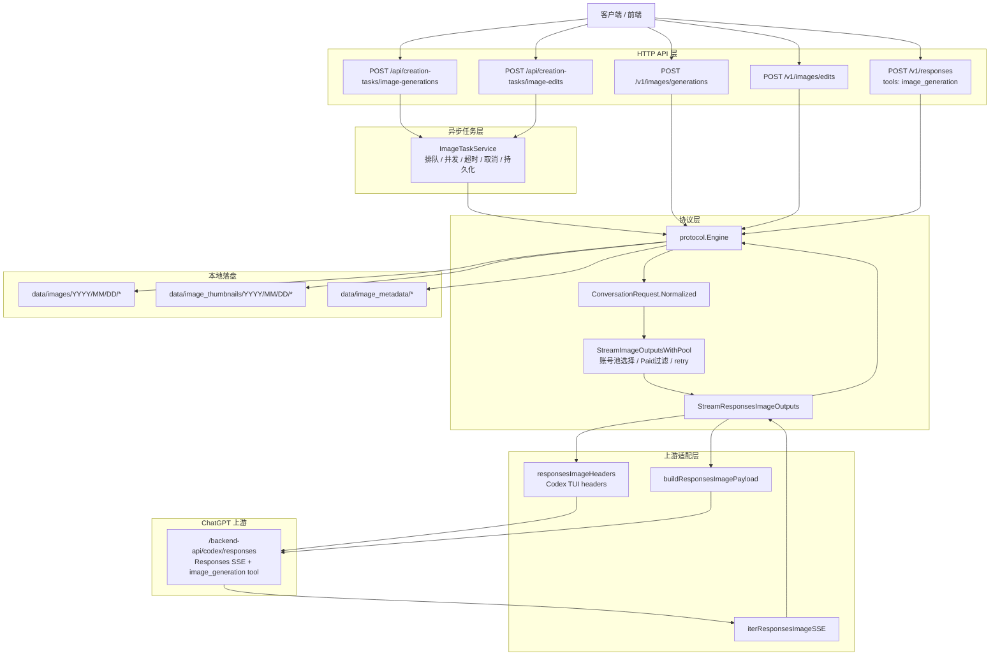

# 生图链路重构与真实测试总结

本文记录本次 `gpt-image-2` / `codex-gpt-image-2` 生图链路重构后的实现状态、路由边界、真实请求测试结果，以及后续前端交互优化和后端稳定性改进的铺垫。本文只描述当前已落地实现和可验证结论，不覆盖 CPA 相关代码，也不保留旧架构兼容方案。

## 结论摘要

- `gpt-image-2` 走官方 `image_generation` tool 语义：请求进入 Responses 图片工具链路时不再把 `gpt-image-2` 作为上游 tool model 强行透传，而是省略 `tools[0].model`，交给官方图片工具默认模型处理。
- `codex-gpt-image-2` 走 Codex 路线：使用 Codex TUI 风格请求头访问 `/backend-api/codex/responses`，并将内部 tool model 映射为 `gpt-5.4-mini`。
- `auto` 默认进入官方 `gpt-image-2` 图片工具语义。
- `free` 账号没有图片工具权限时不在本地伪装成功，可能直接由上游失败；高分辨率尺寸会要求 Paid 图片账号。
- 已通过真实账号池、真实上游请求和 `http://127.0.0.1:7890` 代理验证 Codex 链路的 `jpeg`、`webp` 和 2K `png` 输出。
- 2K Codex 请求耗时较长，真实测试中暴露出 Responses SSE 长流偶发断开问题，已增加有限 transient retry。

## 修改内容

### 后端链路重构

主要修改点：

- `internal/backend/responses_image.go`
  - Codex Responses 图片请求固定走 `/backend-api/codex/responses`。
  - 使用 Codex TUI 风格请求头：
    - `User-Agent: codex-tui/0.128.0 ...`
    - `Originator: codex-tui`
    - `Accept: text/event-stream`
    - `Chatgpt-Account-Id`
    - `Session_id`
  - `tools[0].model` 规则：
    - `auto` / `gpt-image-2` / 空值：省略 `tools[0].model`，使用官方图片工具默认模型。
    - `codex-gpt-image-2`：映射为 `gpt-5.4-mini`。
    - 明确支持 `gpt-5.4`、`gpt-5.5`、`gpt-5-5-thinking` 等 Responses-capable 模型值。
  - `tools[0].size` 归一化：
    - `auto` / 空值：省略。
    - `1:1` -> `1024x1024`
    - `3:2` -> `1536x1024`
    - `2:3` -> `1024x1536`
    - `16:9` / `16x9` -> `1536x864`
    - `9:16` -> `864x1536`
    - `1080p` / `1080x1080` -> `1088x1088`
    - `2k` -> `2048x2048`
    - 超大尺寸按 Responses 图片工具约束收敛，例如 `8192x8192` -> `2880x2880`。
  - Responses 图片尺寸约束：
    - 宽高为 16 的倍数。
    - 最长边不超过 3840。
    - 宽高比不超过 3:1。
    - 像素总量在 `655360` 到 `8294400` 之间。

- `internal/protocol/conversation.go`
  - 图片输出统一进入 `StreamResponsesImageOutputs`。
  - `responsesImageToolModel` 将 `codex-gpt-image-2` 转为后端 Codex tool model。
  - 移除旧 `picture_v2` prompt-hint 路径。
  - 新增 transient Responses SSE 断流识别：
    - `responses SSE read error`
    - `stream error`
    - `INTERNAL_ERROR`
    - `received from peer`
    - `unexpected EOF`
    - `http2: client connection lost`
    - `connection reset by peer`
    - `stream closed`
  - 对上述 transient 错误增加最多 3 次有限重试，避免 2K 长请求因一次上游 SSE 断流直接失败。

- `internal/backend/backend.go`
  - 删除旧图片下载和 legacy picture helper。

- `internal/service/account.go`
  - `RefreshAccountState` 返回 `(map[string]any, error)`。
  - `GetAvailableAccessTokenFor` 保留最后一次刷新错误，避免把刷新失败统一误报为 `no available image quota`。

### 测试与文档

新增或更新：

- `internal/backend/backend_test.go`
  - 覆盖 Codex Responses 路由、请求头、tool model 映射、尺寸归一化。
- `internal/protocol/conversation_test.go`
  - 覆盖 transient SSE 错误识别范围，确保限流、封号、Cloudflare challenge、非法尺寸不会被误判为可重试。
- `internal/service/account_test.go`
  - 覆盖账号刷新错误传播。
- `IMAGE_GENERATION_ARCHITECTURE.md`
  - 根目录架构文档，包含整体架构图和现行链路说明。
- `README.md`
  - 补充 Codex 路由和尺寸归一化说明。

## 修改后的链路

### 总体链路图



### 模型分流规则

| 请求模型 | 当前语义 | 上游 route | `tools[0].model` | 说明 |
| --- | --- | --- | --- | --- |
| `auto` | 官方图片工具默认 | `/backend-api/codex/responses` | 省略 | 默认等价官方 `gpt-image-2` 语义 |
| `gpt-image-2` | 官方链路 | `/backend-api/codex/responses` | 省略 | 不把合成别名传给上游 tool model |
| `codex-gpt-image-2` | Codex 路线 | `/backend-api/codex/responses` | `gpt-5.4-mini` | 使用 Codex TUI headers + Codex tool model 映射 |

注意：当前两条图片链路共享 Responses SSE transport 和账号池调度，分流点主要在 tool model、请求头和模型别名处理上。`gpt-image-2` 的“官方链路”指官方 `image_generation` tool 语义，不再走旧 picture 路径，也不透传 `codex-gpt-image-2` 合成别名。

### 输出格式链路

请求支持：

- `output_format=png`
- `output_format=jpeg`
- `output_format=webp`

PNG 不使用 `output_compression`。JPEG / WebP 可接受 `output_compression`，并在本地结果格式化阶段保持响应中的 `output_format`、文件扩展名和图片内容一致。

### 高分辨率链路

高分辨率尺寸会触发 Paid 账号过滤：

- `2k` -> `2048x2048`
- `2048x2048` -> `2048x2048`
- `4k` 当前按项目规则收敛为合法高像素尺寸，不直接透传超出约束的非法尺寸。

如果账号池没有可用 Plus / Pro / Team 图片账号，会在本地返回：

```text
当前没有可用的 Paid 图片账号，1080P/2K/4K 等高分辨率出图需要 Plus / Pro / Team 账号
```

## 真实测试结果

测试环境：

- 项目目录：`E:\GitHub\chatgpt2api`
- 测试服务：`http://127.0.0.1:18083`
- 上游代理：`http://127.0.0.1:7890`
- 测试日期：2026-05-06
- 账号池：包含 Plus 账号
- 测试方式：通过本项目 HTTP API 发起真实请求，解码 `b64_json` 后检测实际图片格式、尺寸和字节数。

### 官方 `gpt-image-2`

| 模型 | 请求尺寸 | 请求格式 | HTTP 状态 | 实际格式 | 实际尺寸 | 字节数 | 结论 |
| --- | --- | --- | ---: | --- | --- | ---: | --- |
| `gpt-image-2` | `1:1` | `png` | 200 | png | `1024x1024` | 935,879 | 通过 |
| `gpt-image-2` | `16:9` | `jpeg` | 200 | jpeg | `1536x864` | 51,655 | 通过 |
| `gpt-image-2` | `9:16` | `webp` | 200 | webp | `864x1536` | 785,498 | 通过 |

### Codex `codex-gpt-image-2`

| 模型 | 请求尺寸 | 请求格式 | 代理 | HTTP 状态 | 实际格式 | 实际尺寸 | 字节数 | 耗时 | 结论 |
| --- | --- | --- | --- | ---: | --- | --- | ---: | ---: | --- |
| `codex-gpt-image-2` | `1:1` | `png` | 默认代理环境 | 200 | png | `1024x1024` | 923,028 | 未记录 | 通过 |
| `codex-gpt-image-2` | `16:9` | `jpeg` | `127.0.0.1:7890` | 200 | jpeg | `1536x864` | 55,436 | 55.0s | 通过 |
| `codex-gpt-image-2` | `9:16` | `webp` | `127.0.0.1:7890` | 200 | webp | `864x1536` | 754,190 | 34.0s | 通过 |
| `codex-gpt-image-2` | `2k` | `png` | `127.0.0.1:7890` | 200 | png | `2048x2048` | 8,281,198 | 218.7s | 通过 |

2K 结果文件：

```text
E:\GitHub\chatgpt2api\data\images\2026\05\06\1778080053_9682fe414cd4c67f63d5ed9791f53168.png
```

### 失败与修复记录

在加入 transient retry 前，Codex 2K 多次出现长流断开：

| 请求 | 状态 | 错误 |
| --- | ---: | --- |
| `codex-gpt-image-2`, `2k`, `png` | 502 | `http2: client connection lost` |
| `codex-gpt-image-2`, `2048x2048`, `png` | 502 | `unexpected EOF` |
| `codex-gpt-image-2`, `2k`, `png`, `partial_images=3` | 502 | `http2: client connection lost` |

加入 transient retry 后：

- `size=2k` 成功生成 `2048x2048` PNG。
- 显式 `2048x2048` 补测没有打到上游，在本地账号池层返回没有可用 Paid 图片账号。该结果发生在 2K 成功之后，更像当前可用 Plus 图片额度被消耗或暂时不可用，不是 payload 或路由问题。

## 验证命令

已通过：

```powershell
go test ./internal/protocol ./internal/backend ./internal/service
go test ./...
go vet ./...
cd web && npm run lint
cd web && npm run build
```

说明：

- 本次最后一轮只修改 Go 协议层，实际重新执行了 `go test ./internal/protocol ./internal/backend ./internal/service` 和 `go test ./...`。
- `web` lint/build 是前面完整重构阶段已通过的验证；本轮文档和 Go 协议层改动未触及前端代码。
- `cd web && npm run build` 存在 Vite chunk size warning，但构建成功。

## 当前限制与风险

### 账号池与额度

- 高分辨率请求依赖 Plus / Pro / Team 图片账号。
- `2k` 成功后，后续显式 `2048x2048` 测试出现本地 Paid 账号不可用，说明真实额度状态会直接影响后续测试。
- transient SSE 断流当前会触发重试，但仍会调用失败记录逻辑，后续可考虑把“传输临时失败”和“账号真实失败”拆开统计。

### 传输稳定性

- 2K PNG 耗时约 219 秒，远高于 1K、16:9、9:16 请求。
- 长时间 SSE 请求仍受代理、上游 HTTP/2、Cloudflare/session 状态影响。
- 当前最多重试 3 次；如果代理连续断流或上游持续关闭连接，仍会返回真实错误。

### 尺寸语义

- 当前项目 `2k` 语义为 `2048x2048` 正方形。
- `E:\ChatGpt-Image-Studio` 的测试里也出现 `2560x1440` 作为 2K 横向分辨率场景。
- 后续前端需要明确区分：
  - `2K Square`: `2048x2048`
  - `2K Landscape`: `2560x1440`
  - `2K Portrait`: 可按产品定义补充

## 后续前端交互优化铺垫

建议前端优先补齐以下交互能力：

1. 模型路线可视化
   - 在模型选择器中明确展示：
     - `gpt-image-2`: 官方图片工具链路
     - `codex-gpt-image-2`: Codex 链路
   - 对 `codex-gpt-image-2` 提示可能需要 Plus/Paid 权限和更长生成时间。

2. 分辨率选择器重做
   - 不只展示 `1:1`、`16:9`、`2k` 这种输入值，还展示归一化后的实际尺寸。
   - 示例：
     - `1:1 -> 1024x1024`
     - `16:9 -> 1536x864`
     - `9:16 -> 864x1536`
     - `2K Square -> 2048x2048`
   - 高分辨率选项标注 Paid 账号需求。

3. 输出格式与压缩联动
   - `png` 选中时禁用压缩滑块。
   - `jpeg` / `webp` 选中时显示 `output_compression`。
   - 结果卡片显示实际返回格式和尺寸，避免用户误以为请求格式一定等于最终格式。

4. 长任务进度体验
   - 2K Codex 请求可能超过 3 分钟，应在 UI 上明确显示：
     - 已提交
     - 排队中
     - 正在生成
     - 上游重试中
     - 已完成 / 失败
   - 对 transient retry 给出非打扰提示，例如“上游连接中断，正在重试”。

5. 账号池状态提示
   - 当选择 `2k` / `4k` 等高分辨率时，提前显示当前是否有可用 Paid 图片账号。
   - 如果没有可用 Paid 账号，提交前提示，而不是等请求失败后才显示。

6. 代理状态入口
   - 在设置页或图片工作台加入代理检测入口。
   - 显示当前代理 URL、连通性、最近一次检测延迟、最近一次错误摘要。

7. 测试面板
   - 增加内部调试面板，用于一键测试：
     - 官方 `gpt-image-2`: `1:1/png`、`16:9/jpeg`、`9:16/webp`
     - Codex `codex-gpt-image-2`: `1:1/png`、`16:9/jpeg`、`9:16/webp`、`2k/png`
   - 输出实际尺寸、格式、耗时、文件大小、账号类型、错误类型。

## 后续后端改进铺垫

建议后端优先改进以下方向：

1. 重试观测增强
   - 日志中记录每次图片请求的：
     - requested model
     - resolved route
     - resolved tool model
     - requested size
     - normalized size
     - output format
     - selected account type
     - retry count
     - upstream duration
     - error class

2. transient 失败与账号失败分离
   - 当前 transient SSE 断流会释放账号槽并进入重试，但失败统计仍可能和账号真实失败混在一起。
   - 建议增加独立字段，例如：
     - `transport_fail`
     - `upstream_stream_retry`
     - `quota_fail`
     - `auth_fail`
   - 避免代理抖动污染账号健康度。

3. Paid 账号可用性诊断
   - 增加 API 返回当前可用 Paid 图片账号数量、限流数量、异常数量、未知额度数量。
   - 高分辨率请求失败时返回更具体原因：
     - 没有 Paid 账号
     - Paid 账号正在并发占用
     - Paid 账号额度未知刷新失败
     - Paid 账号已限流

4. 尺寸策略统一
   - 当前 `2k` 是 `2048x2048`。
   - 建议后端暴露尺寸 preset 列表给前端，避免前后端各自维护：
     - label
     - request value
     - normalized size
     - ratio
     - paid required
     - supported models

5. 上游 transport 优化
   - Codex 2K 长流对代理和 HTTP/2 稳定性敏感。
   - 可参考 `E:\ChatGpt-Image-Studio` 的 Chrome/uTLS HTTP/2 transport，以及 `E:\GitHub\sub2api` 的 Codex / Responses WebSocket v2 相关实现，评估是否引入更稳定的上游传输。
   - 不建议在未完成验证前新增复杂传输层依赖；可先做可插拔 transport 接口和灰度配置。

6. 真实链路回归测试脚本化
   - 将本次手工真实测试沉淀为脚本，例如：
     - `scripts/test-image-routes.ps1`
     - 支持读取 `.env` 管理员密码但不打印 secret。
     - 输出 JSON 测试报告。
     - 自动检测图片格式、尺寸、字节数。
   - 作为后续改动 Codex 链路、尺寸归一化、账号池调度时的人工验收工具。

7. 任务层 retry 语义
   - 目前 `/v1/images/generations` 同步请求在一次 HTTP 请求内完成有限重试。
   - 对管理端异步任务，可进一步把 transient retry 表达为任务状态：
     - `running`
     - `retrying`
     - `retry_backoff`
   - 前端可以据此展示更准确的进度。

## 推荐下一步

短期优先级：

1. 前端展示实际归一化尺寸和 Paid 要求。
2. 前端结果卡展示实际返回格式、尺寸、耗时、文件大小。
3. 后端日志增加 resolved route / tool model / normalized size / retry count。
4. 脚本化真实链路测试，减少每次手工构造请求。

中期优先级：

1. 拆分 transient transport failure 与账号真实失败统计。
2. 增加 Paid 图片账号可用性诊断 API。
3. 明确 `2k` preset 产品语义，必要时增加 `2k-square`、`2k-landscape` 等显式选项。
4. 评估 Codex 长流 transport 稳定性增强方案。
